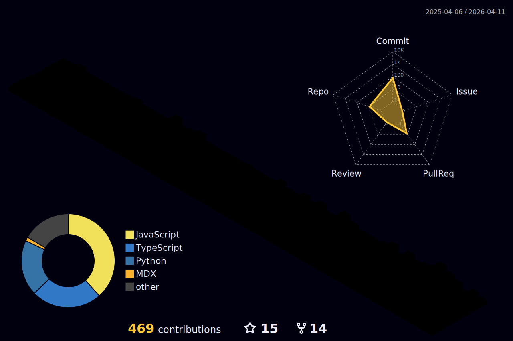

<h1 align="center">Hi 👋, I'm Qaidjohar Jukker</h1>
<h3 align="center">Aspiring Software Engineer</h3>
 

# 💫 About Me:

- 🔭 I’m currently doing **Open-Source Contributions and Freelancing**

- 🌱 I’m currently learning **Py Libraries, STLs, DSA**

- 🤝 I’m looking for help with **AI/ML, Cybersecurity**

- 💬 Ask me about **Software Development and Problem Solvng**

- 📫 Reach me at  **https://qaidjoharj.me**

  

## 🔗 Connect with me:

  

## 🛠️ Languages and Tools:

#

  

## ⚡ GitHub Stats:

  

  &nbsp;&nbsp;   

  

</a>

