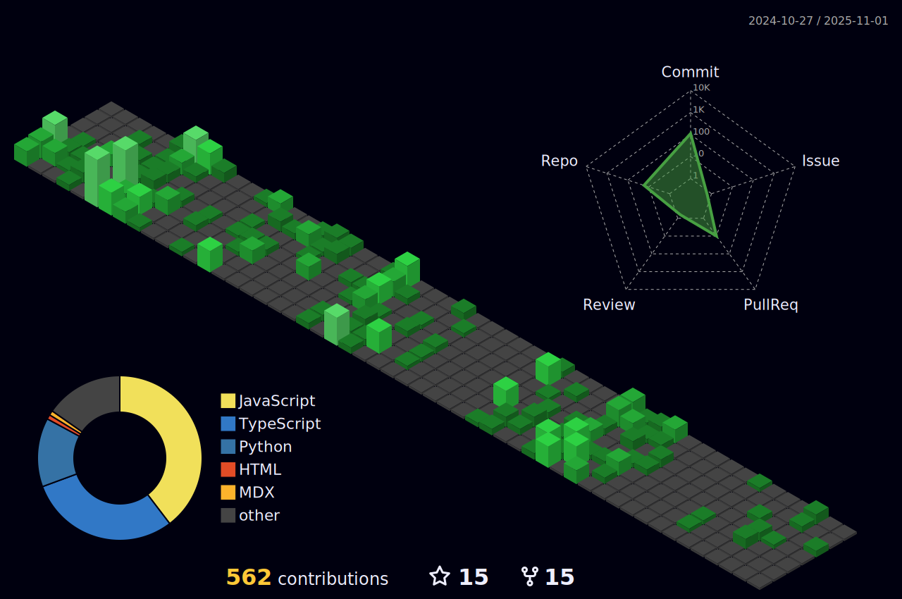

<h1 align="center">Hi 👋, I'm Qaidjohar Jukker</h1>
<h3 align="center">Aspiring AI and Cybersecurity</h3>
 

# 💫 About Me:

- 🔭 I’m currently doing **Open Source Contributions**

- 🌱 I’m currently learning **Py Libraries, Java, STLs, DSA**

- 🤝 I’m looking for help with **AI & ML, Cybersecurity**

- 💬 Ask me about **C, Python, SQL, Problem Solvng**

- 📫 Reach me at  **[E-mail](mailto: "qaidjoharytqt@gmail.com")**, **[LinkedIn](https://www.linkedin.com/in/qaidjoharj53/)** or **[Instagram](https://www.instagram.com/qaidjoharjukker53)**

  

## 🔗 Connect with me:

  

## 🛠️ Languages and Tools:

   
   
  
  
  
  
  
  
  
  
  
  
  
  
  
  

  

## ⚡ GitHub Stats:

  

  &nbsp;&nbsp;   

  

</a>

